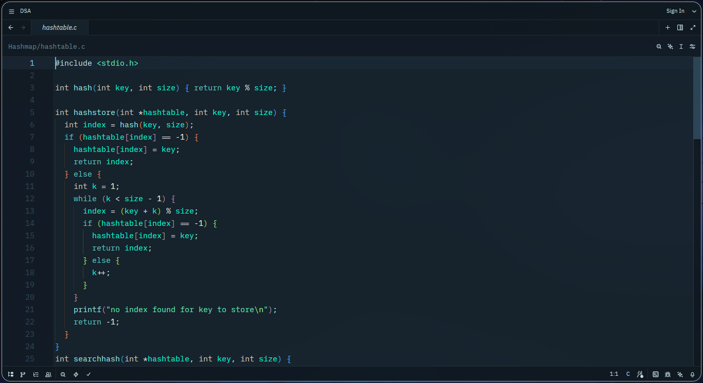
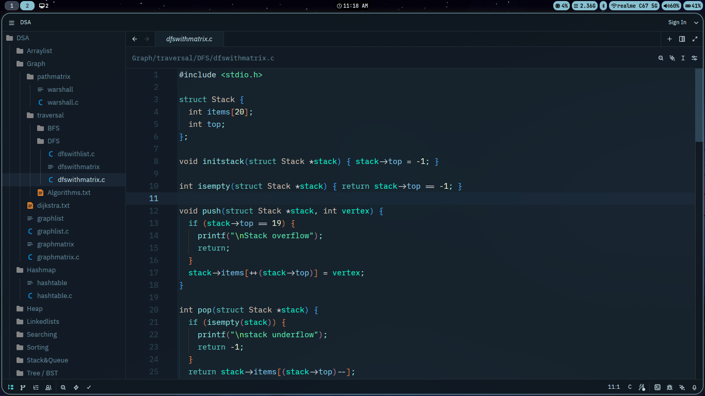

# 🌊 Aquaflow — Zed Theme

**Aquaflow** is a sleek, cool, greenish-aqua theme for [Zed](https://zed.dev), inspired by the calm yet vibrant colors of ocean water.It is my personal zed theme give it a try.

---

## ✨ Features

- Smooth aqua gradients with dark ocean tones
- Minimal eye strain, no contrasts
- Great for late-night coding sessions 🌙

---

## 🧩 Installation

1. Open Extensions in Zed using `Ctrl + Shift + X`.
2. Search for **aquaflow-theme**.
3. Click on **Install**.

That's it! The Aquaflow Theme is now installed.

## 👥 Contributions

Feel free to contribute to this project! Your suggestions and improvements are always welcome.
