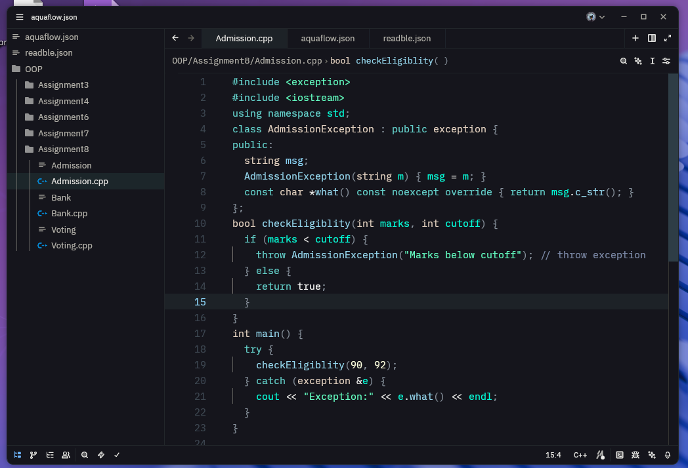
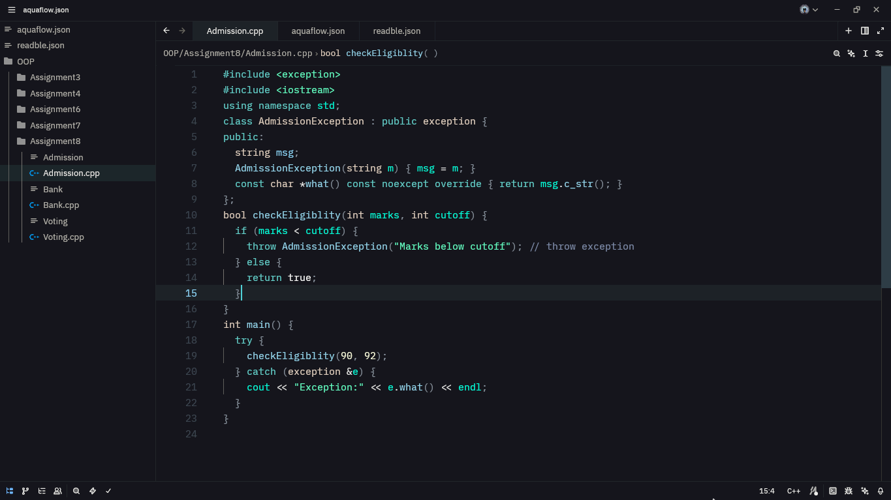

# 🌊 Aquaflow — Zed Theme

**Aquaflow** is a sleek, cool, greenish-aqua theme for [Zed](https://zed.dev), inspired by the calm yet vibrant colors of ocean water.It is my personal zed theme give it a try.





---

## ✨ Features

- Smooth aqua gradients with dark ocean tones
- Minimal eye strain, no contrasts
- Great for late-night coding sessions 🌙

---

## 🧩 Installation

1. Clone this repository:
   ```bash
   git clone https://github.com/Whitfrost21/zed-Aquaflow.git
   ```
2.Copy or move aquaflow.json file to your config:
```bash
  mv Aquaflow/themes/aquflow.json  ~/.config/zed/themes/
```
   Or
```bash
  cp Aquaflow/themes/aquflow.json  ~/.config/zed/themes/
```
3.Open Zed then Command Palette -> Select Theme -> aquaflow.

### Or you can directly download and use the json file in your zed's config by moving it in:

```bash
~/.config/zed/themes/
```
